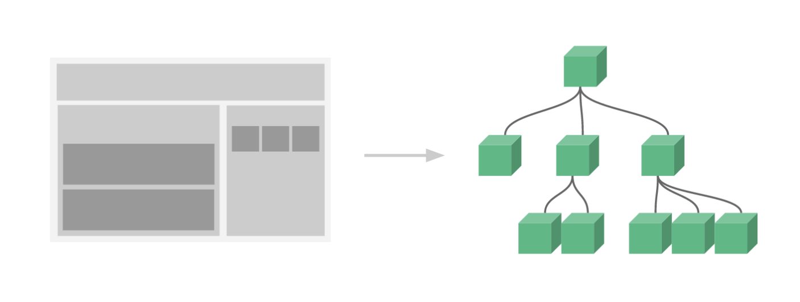

# Components Basics

* Organizing Components
* Passing Data to Child Components with Props
* A Single Root Element
* Listening to Child Components Events
* Content Distribution with Slots
* Dynamic Components
* DOM Template Parsing Caveats

```javascript
new Vue({
    el: ,
    template: ,
    data: ,
    methods: ,
    created: ,
    watch: ,
});
```

## Base Example 

1. 글로벌  

```javascript 
// Define a new component called button-counter
Vue.component('button-counter', {
  data: function () {
    return {
      count: 0
    }
  },
  template: '<button v-on:click="count++">You clicked me {{ count }} times.</button>'
})
```

2. 로컬 

``` javascript
var buttonCounter = {
    data(){
        return{
            count:0,
        }
    },
    template:'<button v-on:click="count++">You clicked me {{ count }} times.</button>'
};

new Vue({
    components:{
        'button-counter':buttonCounter,
    }
})
```

## Reusing Components 

컴포넌트는 원하는 만큼 계속 재사용이 가능하다. 컴포넌트로 만들때, 컴포넌트 내에 데이터를 이용하기 때문에, 각각의 버튼을 클릭해서 적히는 숫자들은 서로 다른 카운트를 갖는다. 즉, 컴포넌트를 재사용한다는 것은 하나의 새로운 인스턴스를 만드는 것과 같다. 
Components can be reused as many times as you want:
.Notice that when clicking on the buttons, each one maintains its own, separate count. That’s because each time you use a component, a new instance of it is created.

```HTML
<div id="components-demo">
  <button-counter></button-counter>
  <button-counter></button-counter>
  <button-counter></button-counter>
</div>
```

### data Must Be a Function

아래와 같이 데이터는 함수의 형태여야 한다. 

```javascript
var componentsDemo = {
  data: function () {
    return {
      count: 0
    }
  }
}
```


## Organizing Components

하나의 앱은 아래와 같이 중첩된 컴포넌트의 트리 구조로 구성되는 것이 일반적이다. 


예를 들어서 `header`, `sidebar`, and `content area`와 같은 컴포넌트 들을 가지고 있을때, 그 컴포넌트들은 일반적으로 네비게이션, 포스트 등으로 구성된다.  
그러한 컴포넌트들을 사용하기 위해서는 컴포넌트들이 등록이 되어있어야 한다. 컴포넌트 등록에는 글로벌과 로컬 등록 방식이 있다.  
글로벌로 등록된 컴포넌트의 경우 어떤 새로운 루트 Vue 인스턴스에서도 사용이 가능하다. 그리고 Vue 인스턴스의 서브컴포넌트 내부에서도 모두 사용 가능하다.  

[자세한 등록 방식 내용](https://vuejs.org/v2/guide/components-registration.html)

## Passing Data to Child Components with Props

Earlier, we mentioned creating a component for blog posts. The problem is, that component won’t be useful unless you can pass data to it, such as the title and content of the specific post we want to display. That’s where props come in.

`Props`은 하나의 컴포넌트에 등록할 수 있는 `custom attributes`이다.   `prop attribute`에 값을 전달하게 되면, 그 값은 컴포넌트 인스턴스의 `property`가 된다. 

```javascript
Vue.component('blog-post', {
  props: ['title'],
  template: '<h3>{{ title }}</h3>'
}) //전역 컴포넌트

var blogPost = {
  props: ['title'],
  template: '<h3>{{ title }}</h3>'
}; // 지역 컴포넌트 

new Vue({
  components: {
    'blog-post' : blogPost, // 지역 컴포넌트 사용시 등록  
  }
})
```

하나의 컴포넌트는 원하는 만큼의 `props`를 가질 수 있고, 기본적으로 `props`의 값은 어떤 것도 가능하다. 위의 템플릿에서 보듯이, 컴포넌트의 `props`에 마치 데이터처럼 접근할 수 있다.  

```HTML
<blog-post title="My journey with Vue"></blog-post>
<blog-post title="Blogging with Vue"></blog-post>
<blog-post title="Why Vue is so fun"></blog-post>
```

하지만 일반적인 경우에는 데이터에 posts의 배열으로 가지고 있을 가능성이 더 크다. 

 ```javascript
  var blogPost = {
      props:['posts'],
      template:`
      <div>
          <div v-for="post in posts">{{ post.title }}</div>
      </div>
      `
  };
  new Vue({
      el: '#app',
      data: {
          posts: [
              { id: 1, title: 'My journey with Vue' },
              { id: 2, title: 'Blogging with Vue' },
              { id: 3, title: 'Why Vue is so fun' }
          ],
      },
      components:{
          'blog-post': blogPost,
      }
  });
```

```HTML
  <div id="app">
      <blog-post
          v-bind:posts="posts"
      ></blog-post>
  </div>
```

결과 

```HTML
<div id="app">
  <div>
    <div>My journey with Vue</div>
  </div>
  <div>
    <div>Blogging with Vue</div>
  </div>
  <div>
    <div>Why Vue is so fun</div>
  </div>
</div>
```
## A Single Root Element

모든 컴포넌트는 반드시 하나의 `root element`를 가져야 한다. 

```HTML
<div class="blog-post">
  <h3>{{ title }}</h3>
  <div v-html="content"></div>
</div>
```

```javascript  
var blogPost = {
    props:['post'],
    template:`
    <div>
        <div>{{ post.title }}</div>
    </div>
    `
};
new Vue({
    el: '#app',
    data: {
        posts: [
            { id: 1, title: 'My journey with Vue' },
            { id: 2, title: 'Blogging with Vue' },
            { id: 3, title: 'Why Vue is so fun' }
        ],
    },
    components:{
        'blog-post': blogPost,
    }
});
```

```HTML
<blog-post
    v-for="post in posts"
    v-bind:key="post.id"
    v-bind:post="post"
></blog-post>
```

## Listening to Child Components Events

## Content Distribution with Slots

## Dynamic Components

## DOM Template Parsing Caveats
