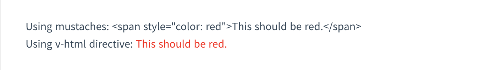

# Template Systax

* Intepolation
  * Text
  * Raw HTML
  * Attributes
  * Using Js Expression
* Directives
  * Arguments
  * Dynamic Arguments
  * Modifiers
* Shorthands
  * v-bind shorthand
  * v-on shorthand

## Interpolation

* text

가장 간단한 방법으로 {{ }} 콧수염 괄호를 통해서 데이터 바인딩을 하는 것이다. data 객체의 값이 바뀌면 업데이터 된다.  

```html
<span>Message: {{ msg }}</span
```

* raw html  

{{ }} 콧수염 괄호는 `plain text` 만을 interpret한다. HTML을 결과물로 만들기 위해서는 `v-html` directives를 사용해야한다. 

```HTML
<p>Using mustaches: {{ rawHtml }}</p>
<p>Using v-html directive: <span v-html="rawHtml"></span></p>
```


* Attribute  
HTML의 attribute를 위해 `v-bind`가 사용된다. 이렇게 작성시 실제 html에서는 `<p id=pius>` 로 나온다. 

```html
<body>
    <div id="app">
       <p v-bind:id="pius712">hello</p> 
    </div>
    <script src="https://cdn.jsdelivr.net/npm/vue/dist/vue.js"></script>
    <script>
        new Vue({
            el : '#app',
            data : {
                pius712: 'pius' 
            }
        })
    </script>
</body>
```
boolean 형의 attribute는 위와는 다르게 동작한다. 아예 `<button>` 태그에서 없는 속성으로 처리된다.
```html
<body>
    <div id="app">
       <button v-bind:disabled="isButtonDisabled">Button</button>
    </div>
    <script src="https://cdn.jsdelivr.net/npm/vue/dist/vue.js"></script>
    <script>
        new Vue({
            el : '#app',
            data : {
                isButtonDisabled: false,
            }
        })
    </script>
</body>
```

## Directives

`v-` 전치사가 붙는 속성을 디렉티브라고 한다. 디렉티브 속성의 값은 단일 JS expression이 붙는다. 디렉티브는 expression이 변했을때, 그 변화를 reactive하게 DOM에게 적용하는 것이다.

### Argument

 몇몇 디렉티브는 argument를 가진다. `v-bind`가 대표적인 예이다. 

```html
<a v-bind:href="url"> ... </a> 
```

위의 경우에는 href가 argument이다. 또 다른 예는 `v-on`이 있다. 

```html
<a v-on:click="doSomething"> ... </a>
``` 
    
위의 경우에는 click이 arugment이고 주로 이벤트에 관한 내용이 속한다. 

### Dynamic Argument

### Modifiers


## Shorthands

### `v-bind` shorthand

```html
<!-- full syntax -->
<a v-bind:href="url"> ... </a>

<!-- shorthand -->
<a :href="url"> ... </a>

<!-- shorthand with dynamic argument (2.6.0+) -->   
<a :[key]="url"> ... </a>
```

### `v-on` shorthand

```html
<!-- full syntax -->
<a v-on:click="doSomething"> ... </a>

<!-- shorthand -->
<a @click="doSomething"> ... </a>

<!-- shorthand with dynamic argument (2.6.0+) -->
<a @[event]="doSomething"> ... </a>
```