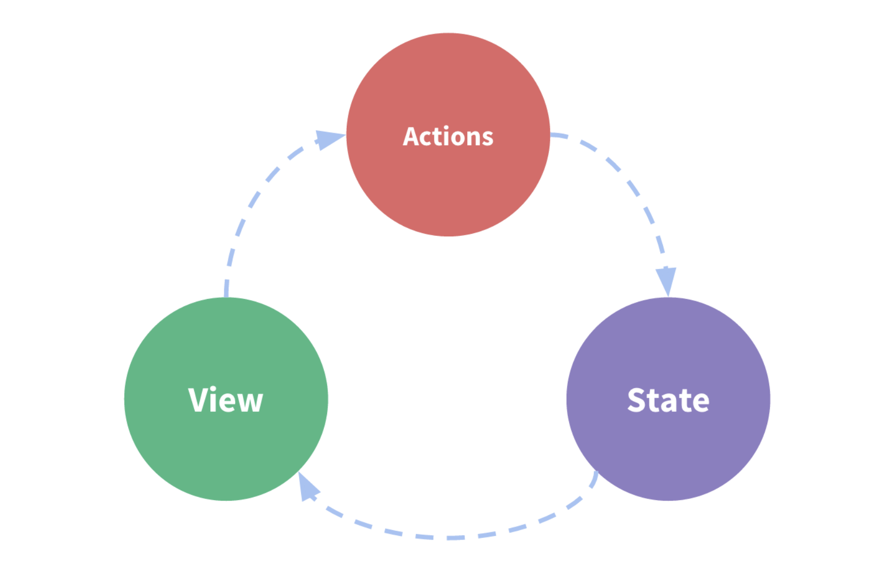

# What is Redux?

리덕스는 `action`이라고 불리는 이벤트를 이용하여 app의 state를 관리하고 업데이트하는 하나의 패턴이고, 라이브러리이다. 중앙 store에서 state를 관리하고, 이 state는 app 전반에서 사용된다. 이 state는 예측가능한 방식으로만 업데이트 될 수 있다는 것을 보장해야한다. 


## Why Should I Use Redux?

리덕스는 global state를 관리하는데 도움을 준다.

리덕스에서 제공되는 패턴과 툴은 언제, 어디서, 왜, 어떻게 state가 업데이트 되는지, 어떻게 app 로직이 동작하는지 쉽게 이해할 수 있게 도와준다. 

## When Should I Use Redux?

리덕스는 분산된 state 관리하는 것을 도와준다. 

Redux is more useful when:

- app의 여러 군데에 사용되는 방대한 양의 state가 있을 경우
- state가 자주 업데이트 되어야 할 때
- state를 업데이트하는 로직이 복잡한 경우
- app이 중간 혹은 큰 사이즈의 codebase를 가지고 있고, 많은 사람들과 협업할 때

모든 앱이 리덕스가 필요한 것은 아니다. 필요에 따라 쓰면 된다. 


# Redux Terms and Concepts

## State Management

작은 React counter component를 보자. 이는 컴포넌트 state에 있는 number를 추적하고, 버튼이 클릭되면 숫자를 증가시킨다.

```js
function Counter() {
  // State: a counter value
  const [counter, setCounter] = useState(0)

  // Action: code that causes an update to the state when something happens
  const increment = () => {
    setCounter(prevCounter => prevCounter + 1)
  }

  // View: the UI definition
  return (
    <div>
      Value: {counter} <button onClick={increment}>Increment</button>
    </div>
  )
}
```

이는 아래의 부분들을 가지는 self-contained app이다. 

- `state`, app을 움직이는 소스의 원천 
- `view`, a 현재 state를 기반으로 하는 선언적 UI description
- `actions`, 유저의 input에 기반한 앱 내의 이벤트, 그리고 이 이벤트는 state의 업데이트를 일으킨다. 

이것은 `one-way data flow`의 하나의 예시이다. :

- `state`는 특정 시간에 앱의 상태를 나타낸다. 
- `UI`는 state를 기반으로 렌더링된다. 
- 유저의 마우스 클릭과 같은 이벤트가 발생하면, state는 그 이벤트를 기반으로 state update된다. 
- UI는 새로운 state에 기반하여 리렌더링된다. 



하지만, 수많은 component들이 생겨서, 컴포넌트 간에 state를 공유하고 같은 state를 사용하게 된다면, 이러한 단순성을 유지하기 어려워 진다. 
특히, 이러한 component가 서로 다른 app의 파트에 있다면 더욱 그렇다. 때때로, 'lifting state up'을 통해서 해결할 수도 있지만 항상 그런 것은 아니다. 

이 문제를 해결하는 방법 중 하나는, 공유되는 state를 component로 부터 분리해내어, 컴포넌트 tree 바깥의 장소에 두는 방식이 있다.  
이를 통해서, component는 tree는 하나의 큰 'view'가 되고, 어떠한 컴포넌트도 이 state에 접근할 수 있고, action을 트리거할 수 있다. 그 컴포넌트가 트리에 어디에 있더라도.

state management와 연관된 개념들을 정의하고 분리함으로써, 그리고 view와 state의 독립성을 유지하는 룰을 강제함으로써, 코드를 보다 구조적이고, 유지보수가 가능하도록 한다. 

이는 Redux의 기본적인 아이디어이다: 하나의 중앙 저장소를 두어서 global state를 유지하고, 특정한 패턴을 따르게 하여, state 업데이트 시에 코드가 보다 예측 가능하도록 하는 것..!

## Immutability

자바스크립트 객체와 배열은 기본적으로 mutable이다. 만약 객체를 생성하면, 그 객체의 내용을 바꿀 수 있고, 배열도 마찬가지이다. 

```js
const obj = { a: 1, b: 2 }
// still the same object outside, but the contents have changed
obj.b = 3

const arr = ['a', 'b']
// In the same way, we can change the contents of this array
arr.push('c')
arr[1] = 'd'
```

이는 객체나 배열을 mutating 한다고 부른다. 메모리 상에서 같은 객체, 배열의 참조를 가지고 있지만, 해당 객체의 내용은 바뀐 것이다. 

값을 immutable하게 바꾸기 위해서는, 기존의 object, array를 복사해야하고, 그 복사본을 수정해야한다. 

자바스크립트의 spread 연산자를 사용하면, 이를 쉽게 할 수 있다. 또한 배열의 복사본을 만들어주는 array 메서드를 사용할 수도 있다.

```js
const obj = {
  a: {
    // To safely update obj.a.c, we have to copy each piece
    c: 3
  },
  b: 2
}

const obj2 = {
  // copy obj
  ...obj,
  // overwrite a
  a: {
    // copy obj.a
    ...obj.a,
    // overwrite c
    c: 42
  }
}

const arr = ['a', 'b']
// Create a new copy of arr, with "c" appended to the end
const arr2 = arr.concat('c')

// or, we can make a copy of the original array:
const arr3 = arr.slice()
// and mutate the copy:
arr3.push('c')
```

리덕스는 모든 state의 업데이트가 immutable하게 되는 것을 원칙으로 한다. 왜냐하면, 어디서, 어떻게 state의 업데이트가 이루어졌는지를 아는 것이 중요하기 때문이다. 

## Terminology

리덕스의 중요한 용어들

### Actions

action은 plain js 객체로, type 필드를 가지고 있다. action을 app에 일어나는 무언가를 기술하는 이벤트라고 생각할 수 있다. 

type 필드는 string이어야 하고, "todos/todoAdded"와 같이 descriptive 한 이름이어야 한다. 일반적으로 `domain/eventName` 같이 작성하고, 첫 번째 파트는 특징이나 action이 속한 카테고리를, 두번째 파트는 실제로 어떤 일이 발생하는 지를 적는다. 

action 객체는 다른 필드를 가질 수 있다. 일반적으로는 `payload` 라는 필드를 통해 정보를 입력한다. 

아래는 action 객체의 예이다. 

```js
const addTodoAction = {
  type: 'todos/todoAdded',
  payload: 'Buy milk'
}
```

### Action Creators

action creator는 action 객체를 만들어서 반환하는 함수이다. 매번 action 객체를 작성할 필요 없도록 해준다. 

```js
const addTodo = text => {
  return {
    type: 'todos/todoAdded',
    payload: text
  }
}
```

### Reducers

reducer는 현재의 state와 action 객체를 받아서, 어떻게 state를 업데이트할 지를 결정한다. 필요하다면, 새로운 객체를 리턴하기도 한다. 
`(state, action) => newState`.

리듀서는 아래의 룰을 반드시 따라야한다.

- 리듀서는 반드시 state, action 인자를 바탕으로 새로운 state value를 계산해야한다. 
- 기존의 state를 수정하는 것은 허용되지 않는다. 대신에, immutable 업데이트를 해야한다. 즉, 기존의 state를 복사야여, 복사본에 변경을 해야한다. - 리듀서는 어떠한 비동기 로직을 처리해서는 안된다. 그리고 random 값을 계산해서도 안되고, 그 외의 "side effects"를 일으켜서는 안된다. 

리듀서의 규칙들에 대해서는 뒤에 더 다루게 된다.(왜 리듀서가 중요한지, 어떻게 그 규칙들을 잘 따를 수 있는지를 포함해서)

리듀서 함수의 내부 로직은 아래의 단계들을 따라야한다. 

- Check to see if the reducer cares about this action
  - If so, make a copy of the state, update the copy with new values, and return it
- Otherwise, return the existing state unchanged

아래는 리듀서의 작은 예시이다. 

```js
const initialState = { value: 0 }

function counterReducer(state = initialState, action) {
  // Check to see if the reducer cares about this action
  if (action.type === 'counter/increment') {
    // If so, make a copy of `state`
    return {
      ...state,
      // and update the copy with the new value
      value: state.value + 1
    }
  }
  // otherwise return the existing state unchanged
  return state
}
```

리듀서는 새로운 state가 무엇이 될지 결정하기 위해서, 어떠한 종류의 로직도 사용할 수 있다.
if/else, swith, loop, 등등..

### Store

현재의 리덕스 app의 state는 store라고 불리는 객체로 있다. 

그 store는 리듀서 함수를 전달하면서 생성되고, 현재의 state를 반환하는 getState 메서드를 가진다. 

```js
import { configureStore } from '@reduxjs/toolkit'

const store = configureStore({ reducer: counterReducer })

console.log(store.getState())
// {value: 0}
```

### Dispatch

리덕스 스토어는 `dispatch`라고 불리는 함수를 가지고 있다. state를 업데이트하는 유일한 방법은 `store.dispatch()`를 호출 하는 것이다. 그리고 이 함수에 action 객체를 전달하는 것이다. 스토어는 스토어의 리듀서 함수를 실행하고, 새로운 state를 저장한다. 그리고 getState()를 호출하면 새롭게 업데이트된 값을 얻을 수 있다. 

```js
store.dispatch({ type: 'counter/increment' })

console.log(store.getState())
// {value: 1}
```

dispatching actions는 "trigerring an event"라고 간주할 수 있다. 무언가가 발생했을 때, 우리가 store가 이를 알기를 원하면, Reducer는 이벤트 리스너와 같은 역할을 할 수 있다. 그리고 리듀서가 action을 듣고 그에 대한 반응으로 state를 업데이트 시킨다. 

일반적으로 action을 dispatch하기 위해서 action creator를 호출한다. 

```js
const increment = () => {
  return {
    type: 'counter/increment'
  }
}

store.dispatch(increment())

console.log(store.getState())
// {value: 2}
```

### Selectors

Selector는 store의 state 값에서 특정한 조각을 가져오는 함수이다. application이 커질 수록, 이는 app의 다른 부분에서 같은 데이터를 읽을 필요가 있을 때, 반복되는 로직을 피할 수 있도록 해준다. 


```js
const selectCounterValue = state => state.value

const currentValue = selectCounterValue(store.getState())
console.log(currentValue)
// 2
```


## Redux Application Data Flow

이전에 아래와 같은 순서로 app을 업데이트하는 "one-way data flow"를 보았었다. 

- State describes the condition of the app at a specific point in time
- The UI is rendered based on that state
- When something happens (such as a user clicking a button), the state is updated based on what occurred
- The UI re-renders based on the new state

리덕스는 이 과정을 좀 더 세분화한다. 

- Initial setup:
  - A Redux store is created using a root reducer function
  - The store calls the root reducer once, and saves the return value as its initial state
  - When the UI is first rendered, UI components access the current state of the Redux store, and use that data to decide what to render. They also subscribe to any future store updates so they can know if the state has changed.
- Updates:
  - Something happens in the app, such as a user clicking a button
  - The app code dispatches an action to the Redux store, like dispatch({type: 'counter/increment'})
  - The store runs the reducer function again with the previous state and the current action, and saves the return value as the new state
  - The store notifies all parts of the UI that are subscribed that the store has been updated
  - Each UI component that needs data from the store checks to see if the parts of the state they need have changed.
  - Each component that sees its data has changed forces a re-render with the new data, so it can update what's shown on the screen


