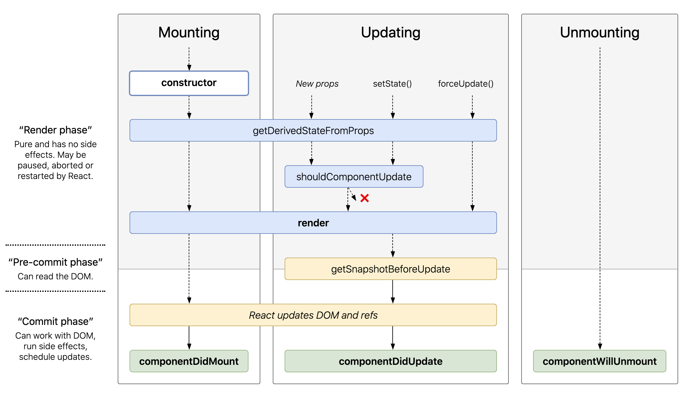

# useEffect 훅 / nextjs

보통 navigation guard를 useEffect로 해왔었다.  
하지만 배포시에 `An unexpected error has occurred` 화면을 받았는데, nextjs의 node server에서 status: 500을 뿜었다.

왜 그런가 했더니 react의 lifeCycle에 대한 이해에 문제가 있었던 것이다.



Nextjs 에서 `getServerSideProps` 실행시, 여기서 받아온 값을 props로 페이지에 넘겨준다. 그런데!!! 나는 props가 아니라 store를 통해서 이를 그려주려고 한다. 

wrapper가 server side store 생성(empty initial state) -> getServerSideProps 실행 -> props로 넘겨주고 redner -> next-reudx-wrapper가 store 만듬 -> 위의 state를 hydrate -> SSR시 component에 store에 state 저장 -> client로 전달 하면서 client 사이드에 store 생성 -> client side에서 hydrate하면서 store 생성 

그러니까, getServerSideProps에서 넘어온 props로 화면을 그릴때는, server side에 store가 비어있다. 

useEffect는 render 이후에 실행되는데, 이를 가지고 navigation을 막을 수는 없는 것이다. 

```js
if(!me) {
  return (뭐뭐)
}
```
이런 식으로 막아줘야한다.

사실 Nextjs를 쓰면서 Props로 전달하지 않으면, 완전한 server side rendering이라고 보기 어렵다. 왜냐하면 결국, client-side에서 store를 기반으로 다시 그려줘야하기 때문.


## 시리즈 2

URL로 들어가는 것과, Link 를 통해 들어가는 동작이 다르다.

URL로 `/pius712` 를 들어갈 경우, useEffect가 실행이 안되는데,  
Link로 들어가는 경우에는 useEffect가 실행이 된다.


Linking between pages
The Next.js router allows you to do client-side route transitions between pages, similarly to a single-page application.

A React component called Link is provided to do this client-side route transition.