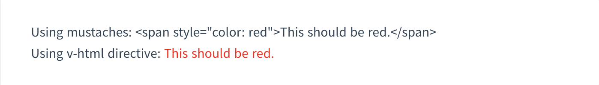

# Template Systax

Vue.js는 HTML 기반의 템플릿 문법을 사용하고 있다. 템플릿 문법은 렌더링된 DOM과 Vue instance의 데이터와 바인딩 시켜준다.  
Vue.js uses an HTML-based template syntax that allows you to declaratively bind the rendered DOM to the underlying Vue instance’s data. All Vue.js templates are valid HTML that can be parsed by spec-compliant browsers and HTML parsers.

Under the hood, Vue compiles the templates into Virtual DOM render functions. Combined with the reactivity system, Vue is able to intelligently figure out the minimal number of components to re-render and apply the minimal amount of DOM manipulations when the app state changes.

If you are familiar with Virtual DOM concepts and prefer the raw power of JavaScript, you can also directly write render functions instead of templates, with optional JSX support.

* Intepolation
  * Text
  * Raw HTML
  * Attributes
  * Using Js Expression
* Directives
  * Arguments
  * Dynamic Arguments
  * Modifiers
* Shorthands
  * v-bind shorthand
  * v-on shorthand

## Interpolation

* text

가장 간단한 방법으로 {{ }} 콧수염 괄호를 통해서 데이터 바인딩을 하는 것이다. data 객체의 값이 바뀌면 업데이터 된다.  

```html
<span>Message: {{ msg }}</span
```

* raw html  

{{ }} 콧수염 괄호는 `plain text` 만을 interpret한다. HTML을 결과물로 만들기 위해서는 `v-html` directives를 사용해야한다. 

```HTML
<p>Using mustaches: {{ rawHtml }}</p>
<p>Using v-html directive: <span v-html="rawHtml"></span></p>
```


* Attribute  
HTML의 attribute를 위해 `v-bind`가 사용된다. 이렇게 작성시 실제 html에서는 `<p id=pius>` 로 나온다. 

```html
<body>
    <div id="app">
       <p v-bind:id="pius712">hello</p> 
    </div>
    <script src="https://cdn.jsdelivr.net/npm/vue/dist/vue.js"></script>
    <script>
        new Vue({
            el : '#app',
            data : {
                pius712: 'pius' 
            }
        })
    </script>
</body>
```

boolean 형의 attribute는 위와는 다르게 동작한다. 아예 `<button>` 태그에서 없는 속성으로 처리된다.

```html
<body>
    <div id="app">
       <button v-bind:disabled="isButtonDisabled">Button</button>
    </div>
    <script src="https://cdn.jsdelivr.net/npm/vue/dist/vue.js"></script>
    <script>
        new Vue({
            el : '#app',
            data : {
                isButtonDisabled: false,
            }
        })
    </script>
</body>
```

## Directives

`v-` 전치사가 붙는 속성을 디렉티브라고 한다. 디렉티브 속성의 값은 단일 JS expression이 붙는다. 디렉티브는 expression이 변했을때, 그 변화를 reactive하게 DOM에게 적용하는 것이다.

### Argument

 몇몇 디렉티브는 argument를 가진다. `v-bind`가 대표적인 예이다. `v-bind`는 HTML의 `attribute`와 바인딩 된다. 

```HTML
<a v-bind:href="url"> ... </a>
```

여기서는 `href`가 인자(argument)인데, 이것은 `v-bind` 디렉티브가 `<a>` 엘리먼트의 href 속성(attirubute)와 뒤에 `expression`과 바인딩 된다는 뜻이다.  

---
**NOTE** 

```HTML
  <div id="app">
      <blog-post
          v-bind:posts="posts"
      ></blog-post>
  </div>
```

여기서 `v-bind:posts`는 무엇을 의미할까? 
> `Props`은 하나의 컴포넌트에 등록할 수 있는 `custom attributes`이다.   `prop attribute`에 값을 전달하게 되면, 그 값은 컴포넌트 인스턴스의 `property`가 된다.

즉, posts라는 `props`를 뒤의 `expression`과 바인딩한다는 말이다. 여기서 `props`는 blog-post 컴포넌트가 가지는 `일종의 attribute` 이다. 

---

```html
<a v-bind:href="url"> ... </a> 
```

위의 경우에는 href가 argument이다. 또 다른 예는 `v-on`이 있다. 

```html
<a v-on:click="doSomething"> ... </a>
```  

위의 경우에는 click이 arugment이고 주로 이벤트에 관한 내용이 속한다.  

### Dynamic Argument

### Modifiers


## Shorthands

### `v-bind` shorthand

```html
<!-- full syntax -->
<a v-bind:href="url"> ... </a>

<!-- shorthand -->
<a :href="url"> ... </a>

<!-- shorthand with dynamic argument (2.6.0+) -->   
<a :[key]="url"> ... </a>
```

### `v-on` shorthand

```html
<!-- full syntax -->
<a v-on:click="doSomething"> ... </a>

<!-- shorthand -->
<a @click="doSomething"> ... </a>

<!-- shorthand with dynamic argument (2.6.0+) -->
<a @[event]="doSomething"> ... </a>
```