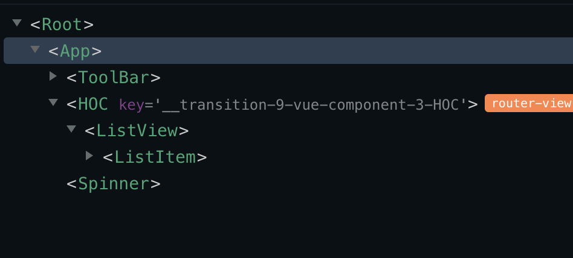

# HOC vs Mixin

## HOC

A higher-order component (HOC)는 리액트 넘어온 컴포넌트 로직을 재사용하기 위한 기술이다. API가 아니라 하나의 패턴이다.  
정확히는, HOC은 새로운 컴포넌트를 리턴해주는 함수이다.

즉, 컴포넌트의 코드를 재사용하는 것이다. 공통적으로 사용되는 컴포넌트의 코드를 상위 컴포

### 예시 코드

아래의 Lifecycle hook은 NewsView/JobsView/AskView 에 공통적으로 들어가는 부분이다. 즉, 중복이 발생한다.

```js
created() {
    // this.$store.dispatch('FETCH_JOBS');
  bus.$emit("start:spinner");
    setTimeout(() => {
      this.$store
        .dispatch("FETCH_JOBS")
        .then(() => {
          console.log("fetched?");
          bus.$emit("end:spinner");
        })
        .catch(err => {
          console.error(err);
        });
    }, 3000);
```

기존의 라우터는 아래의 주석이 없는 형태로 정의가 되어 있다. 그리고 그 각각의 컴포넌트는 비슷한 로직을 사용하고 있는데, 이를 하이어 오더 컴포넌트를 만들어 재사용 하는 것이 목표이다.

```js
import Vue from 'vue';
import VueRouter from 'vue-router';
import createListView from '../pages/CreateListView';
Vue.use(VueRouter);
export const router = new VueRouter({
  mode: 'history',
  routes: [
    {
      path: '/news',
      // component: NewsView,
      component: createListView('NewsView'),
    },
    {
      path: '/ask',
      // component: AskView,
      component: createListView('AskView'),
    },
    {
      path: '/jobs',
      // component: JobsView,
      component: createListView('JobsView'),
    },
  ],
});
```

---

**참고**  
왜 route.index.js에 component 자리에 compoanent의 옵션이 들어있는 객체를 넣어도 동작하는가?  
--> Vue-Router의 공식문서 [참조](https://router.vuejs.org/guide/#javascript)

```js
// 2. Define some routes
// Each route should map to a component. The "component" can
// either be an actual component constructor created via
---
// `Vue.extend()`, or just a component options object.
---
// We'll talk about nested routes later.
const routes = [
  { path: '/foo', component: Foo },
  { path: '/bar', component: Bar }
]
```

실제로, component의 local register는 js의 객체의 형태이다.

---

// 재사용할 인스턴스(컴포넌트) 옵션들이 들어갈 자리  
// el :'',  
// data: '',  
// components:{  
// },  
// creatd(){  
// }

```html
//ListView.vue
<template>
  <div class="ListView">
    <list-item :items="list"></list-item>
  </div>
</template>

<script>
  import ListItem from '../components/ListItem.vue';

  export default {
    components: {
      ListItem,
    },
    computed: {
      list() {
        return this.$store.state.list;
      },
    },
  };
</script>

<style></style>
```

```js
import ListView from './ListView.vue';
import bus from '../utils/bus.js';
export default function createListView(name) {
  return {
    name: name,
    created() {
      bus.$emit('start:spinner');
      // setTimeout(() => {

      // }, 3000);
      console.log('?');
      console.log(this.$route);
      this.$store
        .dispatch('FETCH_LIST', this.$route.name)
        .then(result => {
          bus.$emit('end:spinner');
          return result;
        })
        .catch(err => {
          console.error(err);
        });
    },
    render(createElement) {
      return createElement(ListView);
    },
  };
}
```

```js
//store/index.js
state:{
   list: [],
}

//api/index.js
function fetchList(pageName) {
  return axios.get(`${config.baseUrl}${pageName}/1.json`);
}

//store/actions.js
FETCH_LIST({ commit }, pageName) {
    fetchList(pageName)
      .then(res => {
        commit('SET_LIST', res.data);
      })
      .catch(err => {
        console.error(err);
      });
  },

//sotre/mutations.js
SET_LIST(state, list) {
    state.list = list;
},
```

여기까지 만들었다면, HOC 부분은 만들어진 것이다.

만들면서 들었던 의문점들...

- 왜 ListView를 따로 만들어서 render을 해주나?  
  이 부분은 결국에 ListView가 NewsView/AskView/JobsView를 대체해버린 것이다. 즉, HOC - [ NewsView/AskView/JobsView ] 와 같은 구조를 HOC - ListView로 만든 것이다.

- CreateListView.js에 `template`을 쓰는 것은?  
  render 함수를 지우고 `template` key를 추가해서 화면을 구성하는 것이 가능할까? 이 경우 아래와 같은 에러가 발생하면서, 렌더링이 되지 않는다. 메세지에 의하면, runtime에 정해지는 Vue(함수를 통해 생성되는 컴포넌트)는 template 컴파일러를 쓸 수 없다는 것이다. 즉.. render 함수를 쓰자.

```console
[Vue warn]: You are using the runtime-only build of Vue where the template compiler is not available. Either pre-compile the templates into render functions, or use the compiler-included build.
```


